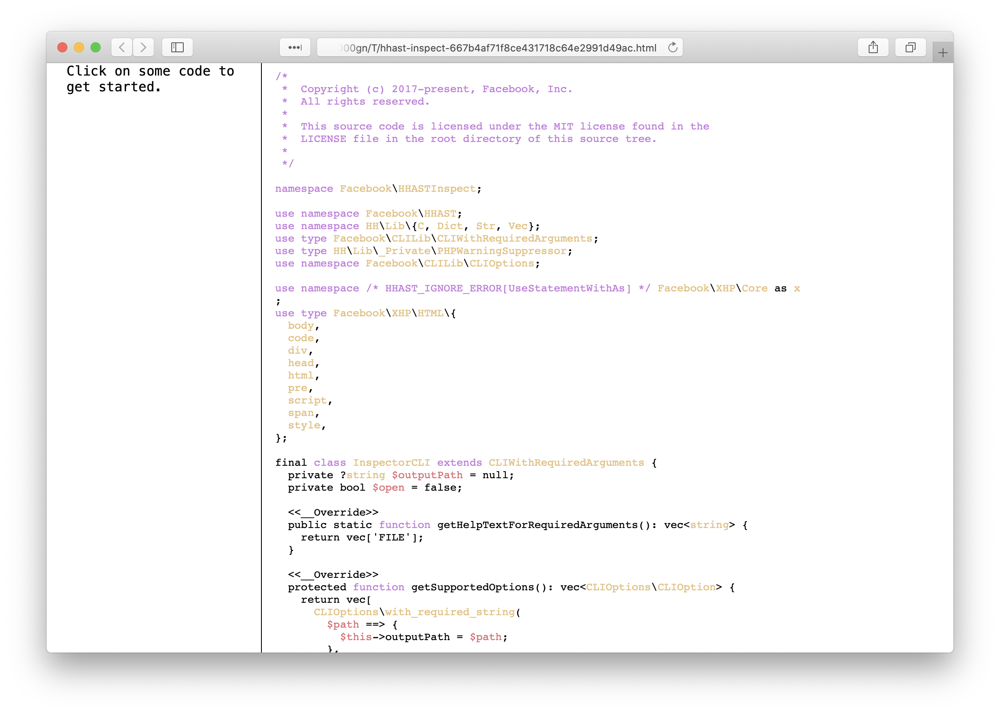
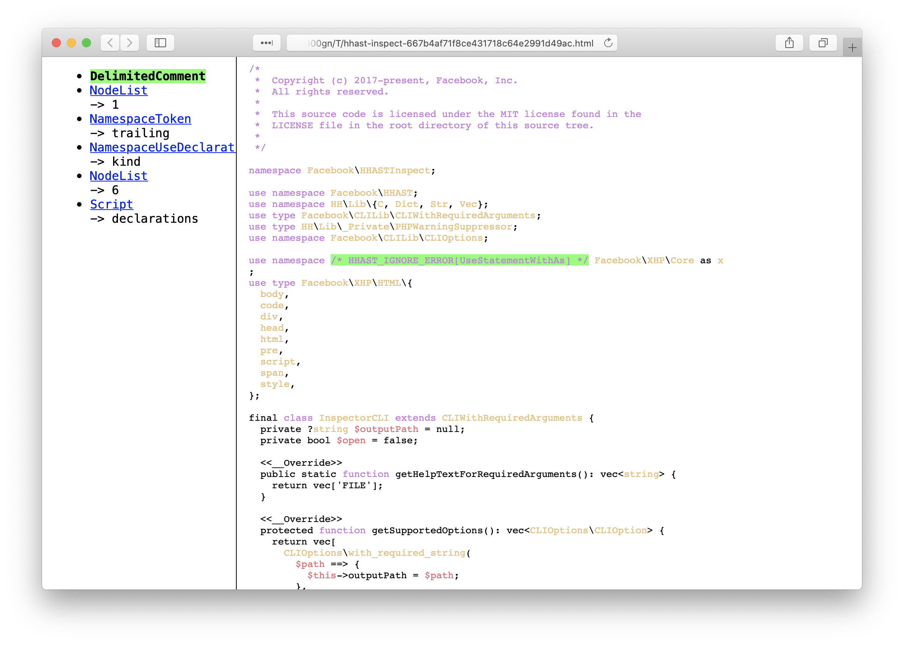
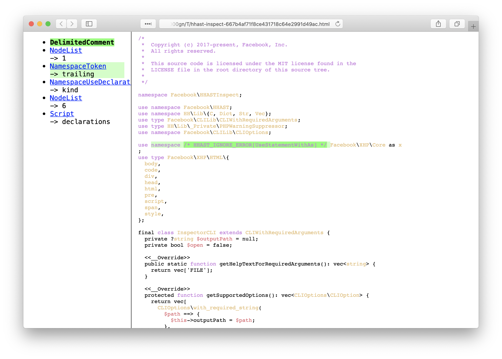

# HHAST-Inspect

HHAST-Inspect is a tool to generate an interactive view of a
[Hack](https://hacklang.org) program's concrete syntax tree, built using
[HHAST](https://github.com/hhvm/hhast/). It was previously included with HHAST,
and is primarily used as a developer tool when working with HHAST, such as when
working on linters or migrations (a.k.a. codemods).

## Installation

1. Clone this repository:
   git clone https://github.com/hhvm/hhast-inspect
2. Install dependencies:
   `cd hhast-inspect; composer install`

## Usage

1. Run `bin/hhast-inspect /path/to/source/file`; this will produce an HTML
   file and show the path
2. Open the output file in a web browser. On most systems, passing `--open` to
   `hhast-inspect` will make it open the file automatically in your default web
   web browser
3. Click on Hack source code to select the syntax tre node, and to show
   information on the node and its' ancestors
4. Click on one of the ancestors to highlight the ancestor - the original node
   remains highlighted in a different color


## Example

```
% bin/hhast-inspect src/InspectorCLI.hack --open
/var/folders/9v/sc1xb84516v_0rv47v0ygm340000gn/T/hhast-inspect-667b4af71f8ce431718c64e2991d49ac.html
```





## License

HHAST-Inspect is MIT-licensed.

